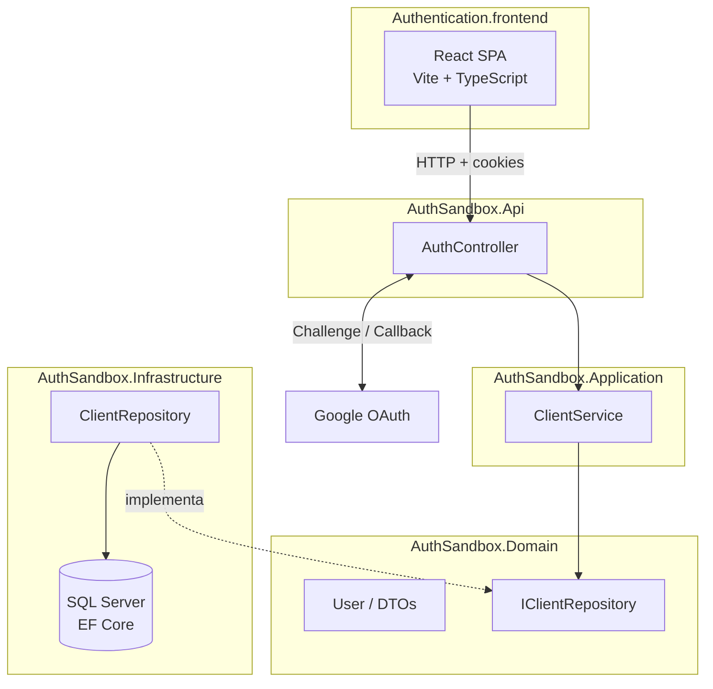

# AuthApi

Microsserviço de autenticação com interface web, voltado a cadastro de usuários e login via Google OAuth. O repositório reúne uma API ASP.NET Core em camadas e um frontend React que consome essa API com cookies e CORS configurados para desenvolvimento local.

---

## Visão geral

O **AuthApi** (internamente organizado como **AuthSandbox**) é um projeto de referência para autenticação de usuários. A ideia central é oferecer um backend que possa ser reutilizado como serviço de identidade — com registro via API e login social pelo Google — e um frontend que demonstre o fluxo completo, incluindo persistência de sessão por cookie após o OAuth.

O backend segue uma separação em camadas inspirada em **Clean Architecture**: domínio isolado, regras na camada de aplicação, persistência na infraestrutura e exposição HTTP na API. O frontend é uma SPA leve com formulários de login/cadastro e uma página protegida que valida a sessão no servidor.

---

## Funcionalidades

| Área                    | Descrição                                                                                                                     |
| ----------------------- | ----------------------------------------------------------------------------------------------------------------------------- |
| **Cadastro**            | Endpoint `POST /Auth/register` recebe nome, e-mail e senha e cria a entidade `User` no domínio.                               |
| **Login Google**        | Fluxo OAuth 2.0: o usuário é redirecionado ao Google, retorna com cookie de autenticação e é enviado ao frontend em `/home`.  |
| **Sessão**              | Autenticação baseada em **cookies** (`CookieAuthentication`) com suporte a credenciais cross-origin (CORS + `SameSite=None`). |
| **Página autenticada**  | `GET /Auth/home` lê as claims do cookie e devolve e-mail e nome do usuário logado.                                            |
| **Logout**              | `GET /Auth/logout` encerra a sessão no servidor.                                                                              |
| **Interface**           | Formulário animado (sign in / sign up), ícones sociais (apenas Google funcional) e roteamento com React Router.               |
| **Documentação da API** | Swagger habilitado em ambiente de desenvolvimento.                                                                            |
| **Testes**              | xUnit no domínio (`User`); Jest + React Testing Library no componente de login.                                               |

> **Nota:** Login por e-mail/senha está parcialmente modelado no domínio e nos serviços, mas o fluxo ativo na UI hoje é o login via Google.

---

## Arquitetura

### Padrões e princípios

- **Arquitetura em camadas** com dependências apontando para o domínio.
- **Injeção de dependência** no `Program.cs` (`IClientService` / `IClientRepository`).
- **Repository pattern** para abstrair acesso a dados (`IClientRepository` → `ClientRepository`).
- **Entidade rica** em `User`, com validações no construtor e método `VerifyPassword`.
- **DTOs de entrada** (`UserRegister`, `UserLogin`) separados da entidade de domínio.

### Diagrama de alto nível



### Camadas do backend

| Projeto                      | Responsabilidade                                                                  |
| ---------------------------- | --------------------------------------------------------------------------------- |
| `AuthSandbox.Api`            | Host HTTP, controllers, CORS, autenticação Google/Cookie, Swagger.                |
| `AuthSandbox.Application`    | Casos de uso (`ClientRegister`, `ClientLogin`).                                   |
| `AuthSandbox.Domain`         | Entidades, contratos de repositório, regras de validação.                         |
| `AuthSandbox.Infrastructure` | `AppDbContext`, migrations EF Core, implementação do repositório.                 |
| `AuthSandbox.Communication`  | Projeto reservado (sem código ainda) — típico para DTOs/contratos de API.         |
| `AuthSandbox.Exception`      | Projeto reservado (sem código ainda) — típico para exceções de domínio/aplicação. |

A solução `AuthApi.sln` referencia os projetos de produção e o projeto de testes de domínio. Outros projetos de teste existem na pasta `tests/Unit`, mas ainda não estão integrados à solution pois não estão finalizados ainda.

---

## Estrutura do repositório

```
AuthApi/
├── README.md
├── README2.md
├── Authentication.backend/
│   ├── AuthApi.sln
│   ├── Src/
│   │   ├── AuthSandbox.Api/           # API REST e Program.cs
│   │   ├── AuthSandbox.Application/   # Serviços de aplicação
│   │   ├── AuthSandbox.Domain/        # Entidades e interfaces
│   │   ├── AuthSandbox.Infrastructure/# EF Core, repositórios, migrations
│   │   ├── AuthSandbox.Communication/ # (scaffold)
│   │   └── AuthSandbox.Exception/     # (scaffold)
│   └── tests/
│       └── Unit/
│           ├── AuthApi.Domain.Tests/
│           ├── AuthApi.Api.Tests/
│           ├── AuthApi.Applications.Tests/
│           └── AuthApi.Infrastructure.Tests/
└── Authentication.frontend/
    ├── src/
    │   ├── Components/    # Loginform, SignIn, SignUp
    │   ├── Style/
    │   ├── App.tsx
    │   ├── Home.tsx
    │   └── main.tsx       # Rotas: / e /home
    ├── package.json
    └── vite.config.ts
```

---

## Tecnologias

### Backend

- **.NET 8** (ASP.NET Core Web API)
- **Entity Framework Core 9** + **SQL Server**
- **Microsoft.AspNetCore.Authentication.Google** (OAuth 2.0)
- **Cookie Authentication**
- **Swashbuckle** (Swagger/OpenAPI)
- **xUnit** (testes de domínio)

### Frontend

- **React 19** + **TypeScript**
- **Vite 7**
- **React Router 7**
- **Jest** + **Testing Library** + **jsdom**
- **react-icons**, **styled-components** (dependências presentes; UI principal usa CSS customizado)

---

## Fluxo do sistema

### 1. Cadastro (sign up)

1. O usuário preenche nome, e-mail e senha no formulário de cadastro.
2. O frontend envia `POST /Auth/register` com JSON `{ Username, Email, PasswordHash }`.
3. `AuthController` delega a `ClientService.ClientRegister`.
4. `ClientRepository.Register` instancia `User` com validações de domínio.

### 2. Login com Google

1. O usuário <span style="color:red">clica no ícone do Google</span> (ou fluxo equivalente) em **Sign In**.
2. O navegador navega para `GET /Auth/login` na API.
3. A API dispara `Challenge` com esquema Google; após autenticação, o callback processa o ticket e grava o cookie.
4. O endpoint `GoogleResponse` redireciona para `http://localhost:5173/home`.
5. A página **Home** chama `GET /Auth/home` com `credentials: "include"`, obtém nome e e-mail das claims e exibe na tela.
6. Se a sessão for inválida, o usuário volta para `/` com query `?login=false`.

### 3. Logout

- `GET /Auth/logout` chama `SignOutAsync` e redireciona (comportamento atual aponta para action `Home` no controller).

---

## API REST

Base sugerida em desenvolvimento: `https://localhost:<porta-da-api>/` (a porta depende do `launchSettings.json`, localmente frequentemente **60292** ou **5005** — alinhe com o frontend).

| Método | Rota                  | Descrição                                         |
| ------ | --------------------- | ------------------------------------------------- |
| `GET`  | `/Auth/login`         | Inicia fluxo OAuth Google.                        |
| `GET`  | `/Auth/signin-google` | Callback pós-Google; redireciona ao frontend.     |
| `GET`  | `/Auth/home`          | Retorna `{ Email, Name }` se o cookie for válido. |
| `GET`  | `/Auth/logout`        | Encerra sessão.                                   |
| `POST` | `/Auth/register`      | Cadastra usuário (body: `UserRegister`).          |

Em desenvolvimento, acesse `/swagger` para explorar os endpoints interativamente.

---

## Pré-requisitos

- [.NET 8 SDK](https://dotnet.microsoft.com/download/dotnet/8.0)
- [Node.js](https://nodejs.org/) 18+ (recomendado LTS)
- **SQL Server** (LocalDB, Express ou instância completa)
- Conta no [Google Cloud Console](https://console.cloud.google.com/) com OAuth 2.0 configurado (Client ID e Client Secret)
- HTTPS de desenvolvimento confiável no .NET (`dotnet dev-certs https --trust`)

---

## Configuração

Os arquivos `appsettings.json` e `launchSettings.json` estão no `.gitignore`. Crie-os localmente na pasta `Authentication.backend/Src/AuthSandbox.Api/`.

### `appsettings.json` (exemplo)

```json
{
  "ConnectionStrings": {
    "DefaultConnection": "Server=(localdb)\\mssqllocaldb;Database=AuthSandboxDb;Trusted_Connection=True;MultipleActiveResultSets=true"
  },
  "Authentication": {
    "Google": {
      "ClientId": "SEU_CLIENT_ID.apps.googleusercontent.com",
      "ClientSecret": "SEU_CLIENT_SECRET"
    }
  },
  "Logging": {
    "LogLevel": {
      "Default": "Information",
      "Microsoft.AspNetCore": "Warning"
    }
  },
  "AllowedHosts": "*"
}
```

### Google OAuth

No Google Cloud Console, configure:

- **Authorized redirect URIs:** `https://localhost:<porta>/signin-google`
- Origens JavaScript autorizadas, se aplicável ao seu ambiente.

### CORS

A API aceita origens `http://localhost:5173` e `https://localhost:5173` com credenciais. O frontend Vite usa por padrão a porta **5173**.

### Alinhar URLs no frontend

Verifique e unifique as URLs da API em:

- `SignUp.tsx` — registro
- `SignIn.tsx` — redirect do login Google
- `Home.tsx` — validação de sessão

Hoje o código mistura `http` e `https` e portas diferentes; use a mesma base URL da API em todos os pontos.

---

## Instalação e execução

### Backend

```bash
cd Authentication.backend/Src/AuthSandbox.Api

# Restaurar dependências (a partir da solution também funciona)
dotnet restore ../../AuthApi.sln

# Aplicar migrations no banco
dotnet ef database update --project ../AuthSandbox.Infrastructure

# Executar a API
dotnet run
```

A API sobe com Swagger em modo Development. Anote a URL HTTPS exibida no terminal.

### Frontend

```bash
cd Authentication.frontend

npm install
npm run dev
```

Acesse `http://localhost:5173`. Para build de produção:

```bash
npm run build
npm run preview
```

### Ordem recomendada

1. Subir SQL Server / LocalDB.
2. Configurar `appsettings.json` e credenciais Google.
3. Rodar migrations e iniciar a API.
4. Iniciar o frontend e testar cadastro + login Google.

---

## Testes

### Backend (xUnit)

```bash
cd Authentication.backend
dotnet test tests/Unit/AuthApi.Domain.Tests
```

Cobertura atual focada na entidade `User`: criação válida, e-mail inválido e verificação de senha.

### Frontend (Jest)

```bash
cd Authentication.frontend
npm test
```

Testes do `Loginform`: estado inicial, alternância entre painéis Sign In e Sign Up.

---

## Exemplos de uso

### Cadastro via curl

```bash
curl -X POST "https://localhost:60292/Auth/register" \
  -H "Content-Type: application/json" \
  -d "{\"Username\":\"Ana\",\"Email\":\"ana@exemplo.com\",\"PasswordHash\":\"senhaSegura123\"}"
```

### Verificar sessão após login Google (navegador ou curl com cookie)

```bash
curl -X GET "https://localhost:60292/Auth/home" \
  -H "Content-Type: application/json" \
  --cookie "cookies.txt"
```

No navegador, após o fluxo OAuth, a página `/home` do frontend faz essa chamada automaticamente com `credentials: "include"`.

### Iniciar login Google

Abra no navegador:

```
https://localhost:60292/Auth/login
```

Ou use o botão Google na tela de Sign In, que redireciona para o mesmo endpoint.

---

## Observações técnicas e melhorias que ainda vão ser feitas

### Arquitetura e código

1. **Persistência no cadastro** — `ClientRepository.Register` cria `User` em memória, mas não chama `_context.Users.Add` nem `SaveChangesAsync`. O cadastro não grava no banco até isso ser implementado.
2. **Hash de senha** — O campo se chama `PasswordHash`, porém o valor é armazenado em texto plano. Recomenda-se BCrypt, Argon2 ou `PasswordHasher<T>` do ASP.NET Identity.
3. **`User.Id`** — O identificador é definido como `public Guid Id { get; } = new Guid();`, o que gera um novo GUID a cada leitura da propriedade. Eu vou botar para atribuir o ID uma única vez no construtor.
4. **Deserialização JSON** — `UserRegister` e `UserLogin` usam setters privados e construtores parametrizados; o model binder do ASP.NET Core pode falhar ao deserializar o body. Vou mudar para records/DTOs públicos ou `[JsonConstructor]`.
5. **Projetos vazios** — `AuthSandbox.Communication` e `AuthSandbox.Exception` estão na solution sem implementação, ainda vou colocar os jsons e erros nesses projetos
6. **Login e-mail/senha** — `ClientLogin` e `Authentication()` no repositório não filtram por credenciais (retornam todos os usuários). O endpoint de login por senha não está exposto; código comentado no frontend e no controller é porque o trabalho está  em andamento ainda.
7. **Testes desatualizados** — `UserTests` usa construtor `User(email, password)` com dois argumentos, enquanto a entidade exige `(username, email, passwordHash)`. Ajustar testes e incluir os demais projetos de teste na solution.
8. **Consistência de URLs** — Unificar esquema (`https`), host e porta entre `SignUp`, `SignIn` e `Home`.
9. **Redirecionamentos e logout** — `Logout` usa `RedirectToAction("Home")`; `GoogleResponse` redireciona com URL fixa. Extrair URLs do frontend para configuração (`appsettings` / variáveis de ambiente).
10. **Segurança em produção** — Revisar `SameSite=None` + `SecurePolicy.Always`, políticas CORS restritas, secrets em variáveis de ambiente e template `appsettings.Development.json` versionado sem segredos.

### Frontend

- Botões Facebook e LinkedIn são apenas visuais por enquanto.
- O formulário de Sign In por e-mail/senha exibe alerta pedindo uso do Google; o submit não autentica por credenciais locais.

### Banco de dados

A migration `InitialCreate` cria a tabela `Users` com `Id`, `Username`, `Email`, `PasswordHash` e `CreatedAt`. Após corrigir o repositório, o EF Core estará pronto para persistir usuários cadastrados.

---

---

## Contribuição

1. Faça fork do repositório.
2. Crie uma branch para sua feature (`git checkout -b feature/minha-melhoria`).
3. Commit suas alterações seguindo o padrão do projeto.
4. Abra um Pull Request descrevendo mudanças e como testar (API + frontend + credenciais Google).

---

*Documentação gerada com base na análise do código-fonte, estrutura de pastas e dependências do repositório AuthApi.*
