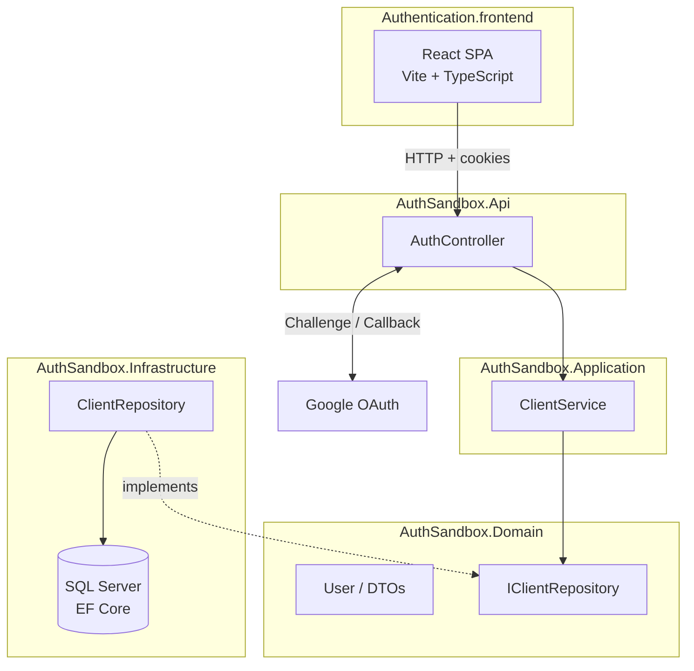

# AuthApi

Authentication microservice with a web interface focused on user registration and login via Google OAuth. The repository brings together a layered ASP.NET Core API and a React frontend that consumes this API with cookies and CORS configured for local development.

---

## Overview

**AuthApi** (internally organized as **AuthSandbox**) is a reference project for user authentication. The main idea is to provide a backend that can be reused as an identity service — with API registration and Google social login — and a frontend that demonstrates the complete flow, including session persistence via cookie after OAuth.

The backend follows a layered separation inspired by **Clean Architecture**: isolated domain, rules in the application layer, persistence in infrastructure, and HTTP exposure in the API. The frontend is a lightweight SPA with login/registration forms and a protected page that validates the session on the server.

---

## Features

| Area                    | Description                                                                                                                     |
| ----------------------- | ----------------------------------------------------------------------------------------------------------------------------- |
| **Registration**        | Endpoint `POST /Auth/register` receives name, email, and password and creates the `User` entity in the domain.                 |
| **Google Login**        | OAuth 2.0 flow: the user is redirected to Google, returns with an authentication cookie, and is sent to the frontend at `/home`. |
| **Session**             | Cookie-based authentication (`CookieAuthentication`) with cross-origin credentials support (CORS + `SameSite=None`).             |
| **Authenticated page**  | `GET /Auth/home` reads claims from the cookie and returns the logged-in user’s email and name.                                 |
| **Logout**              | `GET /Auth/logout` ends the session on the server.                                                                            |
| **Interface**           | Animated form (sign in / sign up), social icons (only Google functional), and routing with React Router.                       |
| **API documentation**   | Swagger enabled in development environment.                                                                                     |
| **Tests**               | xUnit in the domain (`User`); Jest + React Testing Library in the login component.                                             |

> **Note:** Email/password login is partially modeled in the domain and services, but the active UI flow today is login via Google.

---

## Architecture

### Patterns and principles

- **Layered architecture** with dependencies pointing toward the domain.
- **Dependency injection** in `Program.cs` (`IClientService` / `IClientRepository`).
- **Repository pattern** to abstract data access (`IClientRepository` → `ClientRepository`).
- **Rich entity** in `User`, with validations in the constructor and `VerifyPassword` method.
- **Input DTOs** (`UserRegister`, `UserLogin`) separated from the domain entity.

### High-level diagram



### Backend layers

| Project                      | Responsibility                                                                    |
| ---------------------------- | --------------------------------------------------------------------------------- |
| `AuthSandbox.Api`            | HTTP host, controllers, CORS, Google/Cookie authentication, Swagger.             |
| `AuthSandbox.Application`    | Use cases (`ClientRegister`, `ClientLogin`).                                     |
| `AuthSandbox.Domain`         | Entities, repository contracts, validation rules.                                |
| `AuthSandbox.Infrastructure` | `AppDbContext`, EF Core migrations, repository implementation.                   |
| `AuthSandbox.Communication`  | Reserved project (no code yet) — typical for API DTOs/contracts.                  |
| `AuthSandbox.Exception`      | Reserved project (no code yet) — typical for domain/application exceptions.       |

The `AuthApi.sln` solution references the production projects and the domain test project. Other test projects exist under `tests/Unit`, but they are not yet integrated into the solution because they are still unfinished.

---

## Repository structure

```
AuthApi/
├── README.md
├── README2.md
├── Authentication.backend/
│   ├── AuthApi.sln
│   ├── Src/
│   │   ├── AuthSandbox.Api/           # REST API and Program.cs
│   │   ├── AuthSandbox.Application/   # Application services
│   │   ├── AuthSandbox.Domain/        # Entities and interfaces
│   │   ├── AuthSandbox.Infrastructure/# EF Core, repositories, migrations
│   │   ├── AuthSandbox.Communication/ # (scaffold)
│   │   └── AuthSandbox.Exception/     # (scaffold)
│   └── tests/
│       └── Unit/
│           ├── AuthApi.Domain.Tests/
│           ├── AuthApi.Api.Tests/
│           ├── AuthApi.Applications.Tests/
│           └── AuthApi.Infrastructure.Tests/
└── Authentication.frontend/
    ├── src/
    │   ├── Components/    # Loginform, SignIn, SignUp
    │   ├── Style/
    │   ├── App.tsx
    │   ├── Home.tsx
    │   └── main.tsx       # Routes: / and /home
    ├── package.json
    └── vite.config.ts
```

---

## Technologies

### Backend

- **.NET 8** (ASP.NET Core Web API)
- **Entity Framework Core 9** + **SQL Server**
- **Microsoft.AspNetCore.Authentication.Google** (OAuth 2.0)
- **Cookie Authentication**
- **Swashbuckle** (Swagger/OpenAPI)
- **xUnit** (domain tests)

### Frontend

- **React 19** + **TypeScript**
- **Vite 7**
- **React Router 7**
- **Jest** + **Testing Library** + **jsdom**
- **react-icons**, **styled-components** (dependencies present; main UI uses custom CSS)

---

## System flow

### 1. Registration (sign up)

1. The user fills in name, email, and password in the registration form.
2. The frontend sends `POST /Auth/register` with JSON `{ Username, Email, PasswordHash }`.
3. `AuthController` delegates to `ClientService.ClientRegister`.
4. `ClientRepository.Register` instantiates `User` with domain validations.

### 2. Google login

1. The user <span style="color:red">clicks the Google icon</span> (or equivalent flow) in **Sign In**.
2. The browser navigates to `GET /Auth/login` on the API.
3. The API triggers `Challenge` with the Google scheme; after authentication, the callback processes the ticket and writes the cookie.
4. The `GoogleResponse` endpoint redirects to `http://localhost:5173/home`.
5. The **Home** page calls `GET /Auth/home` with `credentials: "include"`, obtains name and email from the claims, and displays them.
6. If the session is invalid, the user returns to `/` with query `?login=false`.

### 3. Logout

- `GET /Auth/logout` calls `SignOutAsync` and redirects (current behavior points to the `Home` action in the controller).

---

## REST API

Suggested development base: `https://localhost:<api-port>/` (the port depends on `launchSettings.json`; locally often **60292** or **5005** — align with the frontend).

| Method | Route                  | Description                                         |
| ------ | --------------------- | ------------------------------------------------- |
| `GET`  | `/Auth/login`         | Starts the Google OAuth flow.                       |
| `GET`  | `/Auth/signin-google` | Google callback; redirects to the frontend.         |
| `GET`  | `/Auth/home`          | Returns `{ Email, Name }` if the cookie is valid.   |
| `GET`  | `/Auth/logout`        | Ends the session.                                   |
| `POST` | `/Auth/register`      | Registers a user (body: `UserRegister`).            |

In development, visit `/swagger` to explore the endpoints interactively.

---

## Prerequisites

- [.NET 8 SDK](https://dotnet.microsoft.com/download/dotnet/8.0)
- [Node.js](https://nodejs.org/) 18+ (recommended LTS)
- **SQL Server** (LocalDB, Express, or full instance)
- Account in [Google Cloud Console](https://console.cloud.google.com/) with OAuth 2.0 configured (Client ID and Client Secret)
- Trusted development HTTPS in .NET (`dotnet dev-certs https --trust`)

---

## Configuration

The files `appsettings.json` and `launchSettings.json` are in `.gitignore`. Create them locally in `Authentication.backend/Src/AuthSandbox.Api/`.

### `appsettings.json` (example)

```json
{
  "ConnectionStrings": {
    "DefaultConnection": "Server=(localdb)\\mssqllocaldb;Database=AuthSandboxDb;Trusted_Connection=True;MultipleActiveResultSets=true"
  },
  "Authentication": {
    "Google": {
      "ClientId": "SEU_CLIENT_ID.apps.googleusercontent.com",
      "ClientSecret": "SEU_CLIENT_SECRET"
    }
  },
  "Logging": {
    "LogLevel": {
      "Default": "Information",
      "Microsoft.AspNetCore": "Warning"
    }
  },
  "AllowedHosts": "*"
}
```

### Google OAuth

In Google Cloud Console, configure:

- **Authorized redirect URIs:** `https://localhost:<port>/signin-google`
- JavaScript authorized origins, if applicable to your environment.

### CORS

The API accepts origins `http://localhost:5173` and `https://localhost:5173` with credentials. The Vite frontend uses port **5173** by default.

### Align URLs in the frontend

Check and unify the API URLs in:

- `SignUp.tsx` — registration
- `SignIn.tsx` — Google login redirect
- `Home.tsx` — session validation

Today the code mixes `http` and `https` and different ports; use the same API base URL in all places.

---

## Installation and execution

### Backend

```bash
cd Authentication.backend/Src/AuthSandbox.Api

# Restore dependencies (from the solution also works)
dotnet restore ../../AuthApi.sln

# Apply migrations to the database
dotnet ef database update --project ../AuthSandbox.Infrastructure

# Run the API
dotnet run
```

The API starts with Swagger in Development mode. Note the HTTPS URL shown in the terminal.

### Frontend

```bash
cd Authentication.frontend

npm install
npm run dev
```

Open `http://localhost:5173`. For production build:

```bash
npm run build
npm run preview
```

### Recommended order

1. Start SQL Server / LocalDB.
2. Configure `appsettings.json` and Google credentials.
3. Run migrations and start the API.
4. Start the frontend and test registration + Google login.

---

## Tests

### Backend (xUnit)

```bash
cd Authentication.backend
dotnet test tests/Unit/AuthApi.Domain.Tests
```

Current coverage focuses on the `User` entity: valid creation, invalid email, and password verification.

### Frontend (Jest)

```bash
cd Authentication.frontend
npm test
```

`Loginform` tests: initial state, switching between Sign In and Sign Up panels.

---

## Usage examples

### Registration via curl

```bash
curl -X POST "https://localhost:60292/Auth/register" \
  -H "Content-Type: application/json" \
  -d "{\"Username\":\"Ana\",\"Email\":\"ana@exemplo.com\",\"PasswordHash\":\"senhaSegura123\"}"
```

### Verify session after Google login (browser or curl with cookie)

```bash
curl -X GET "https://localhost:60292/Auth/home" \
  -H "Content-Type: application/json" \
  --cookie "cookies.txt"
```

In the browser, after the OAuth flow, the frontend `/home` page makes this call automatically with `credentials: "include"`.

### Start Google login

Open in the browser:

```
https://localhost:60292/Auth/login
```

Or use the Google button on the Sign In screen, which redirects to the same endpoint.

---

## Technical notes and improvements still to be made

### Architecture and code

1. **Persistence on registration** — `ClientRepository.Register` creates `User` in memory but does not call `_context.Users.Add` or `SaveChangesAsync`. The registration does not persist to the database until this is implemented.
2. **Password hashing** — The field is named `PasswordHash`, but the value is stored in plain text. BCrypt, Argon2, or ASP.NET Identity `PasswordHasher<T>` is recommended.
3. **`User.Id`** — The identifier is defined as `public Guid Id { get; } = new Guid();`, which generates a new GUID on every property read. I will change it to assign the ID once in the constructor.
4. **JSON deserialization** — `UserRegister` and `UserLogin` use private setters and parameterized constructors; ASP.NET Core model binding may fail to deserialize the body. I will change them to public records/DTOs or use `[JsonConstructor]`.
5. **Empty projects** — `AuthSandbox.Communication` and `AuthSandbox.Exception` are in the solution without implementation; I will add JSONs and errors to those projects.
6. **Email/password login** — `ClientLogin` and `Authentication()` in the repository do not filter by credentials (they return all users). The password login endpoint is not exposed; commented code in the frontend and controller exists because the work is still in progress.
7. **Outdated tests** — `UserTests` uses `User(email, password)` with two arguments, while the entity requires `(username, email, passwordHash)`. Update tests and include the other test projects in the solution.
8. **URL consistency** — Unify scheme (`https`), host, and port between `SignUp`, `SignIn`, and `Home`.
9. **Redirects and logout** — `Logout` uses `RedirectToAction("Home")`; `GoogleResponse` redirects with a fixed URL. Extract frontend URLs to configuration (`appsettings` / environment variables).
10. **Production security** — Review `SameSite=None` + `SecurePolicy.Always`, restrictive CORS policies, secrets in environment variables, and a versioned `appsettings.Development.json` template without secrets.

### Frontend

- Facebook and LinkedIn buttons are only visual for now.
- The Sign In email/password form shows an alert asking to use Google; the submit does not authenticate with local credentials.

### Database

The `InitialCreate` migration creates the `Users` table with `Id`, `Username`, `Email`, `PasswordHash`, and `CreatedAt`. After fixing the repository, EF Core will be ready to persist registered users.

---

---

## Contribution

1. Fork the repository.
2. Create a branch for your feature (`git checkout -b feature/minha-melhoria`).
3. Commit your changes following the project standard.
4. Open a Pull Request describing the changes and how to test (API + frontend + Google credentials).

---

*Documentation generated based on analysis of the AuthApi repository source code, folder structure, and dependencies.*
